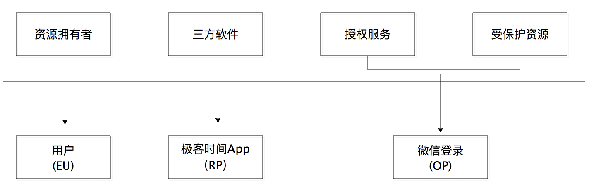
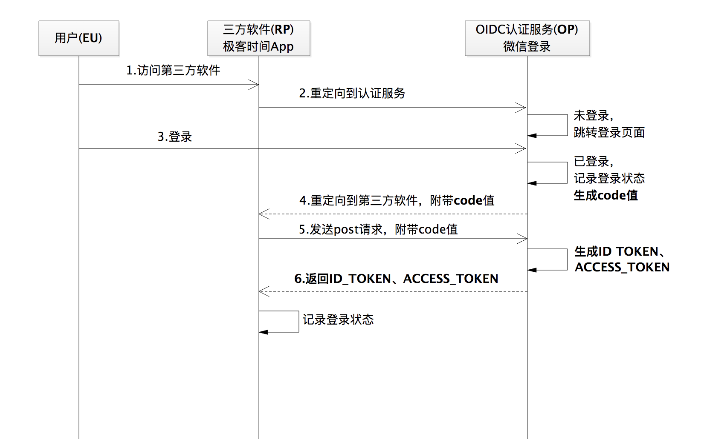

# OpenID Connect

## 1. 什么是OpenID Connect
- OpenID Connect简称OIDC。其实就是一种用户身份认证的开放标准。
使用微信账号登录极客时间的场景，就是这种开放标准的实践。
- 更概括地说，OIDC 就是直接基于 OAuth 2.0 构建的身份认证框架协议。
- 换种表述方式，OIDC= 授权协议 + 身份认证，是 OAuth 2.0 的超集。

## 2. OIDC 中的角色
- EU（End User），代表最终用户。
- RP（Relying Party），代表认证服务的依赖方，就是上面我提到的第三方软件。
- OP（OpenID Provider），代表提供身份认证服务方。

---

EU、RP、OP与OAuth2中角色的对应关系如下：

## 3. OIDC 协议流程

一个基于授权码流程的 OIDC 协议流程，跟 OAuth 2.0 中的授权码许可的流程几乎完全一致，
唯一的区别就是多返回了一个 ID_TOKEN，我们称之为 ID 令牌。这个令牌是身份认证的关键。

- ID 令牌（ID_TOKEN）和访问令牌（ACCESS_TOKEN）是一起返回的。
- ID 令牌是一个 JWT 格式的令牌。

### ID令牌的内容：
- iss，令牌的颁发者，其值就是身份认证服务（OP）的 URL。
- sub，令牌的主题，其值是一个能够代表最终用户（EU）的全局唯一标识符。
- aud，令牌的目标受众，其值是三方软件（RP）的 app_id。
- exp，令牌的到期时间戳，所有的 ID 令牌都会有一个过期时间。
- iat，颁发令牌的时间戳。

## 4. OCID如何处理用户登录状态？
- 一般的做法是，要么放在远程服务器上，要么写进浏览器的 cookie 中，同时为会话 ID 设置一个过期时间。
但是，当有了一个 JWT 这样的结构化信息体的时候，尤其是包含了令牌的主题和过期时间后，就有了一个“天然”的会话关系信息。

- 依靠 JWT 格式的 ID 令牌，就足以让我们解决身份认证后的登录态问题。
这也就是为什么在 OIDC 协议里面要返回 ID 令牌的原因，ID 令牌才是 OIDC 作为身份认证协议的关键所在。

- 三方软件验证 ID_TOKEN(JWT) 合法性的时候，因为 ID 令牌本身已经被身份认证服务（OP）的密钥签名过，
所以关键的一点是合法性校验时需要做签名校验。这样当第三方软件（RP）拿到 ID 令牌之后，就已经获得了处理身份认证标识动作的信息，也就是拿到了那个能够唯一标识最终用户（EU）的 ID 值，比如 3521。

- 在页面上显示 “您好，3521” 肯定不如显示 “您好，小明同学”的体验好
那如何来获取“小明同学”这个昵称呢。这也很简单，就是通过返回的访问令牌 access_token 来重新发送一次请求。
获取ID之外的信息，仍是通过access_token进行。

- 这样看下来，细粒度地去看 OIDC 的流程就是：
生成 ID 令牌 -> 创建 UserInfo 端点 -> 解析 ID 令牌 -> 记录登录状态 -> 获取 UserInfo。

## 5. 总结：
- OAuth 2.0 不是一个身份认证协议，请一定要记住这点。
身份认证强调的是“谁的问题”，而 OAuth2.0 强调的是授权，是“可不可以”的问题。
但是，我们可以在 OAuth2.0 的基础上，通过增加 ID 令牌来获取用户的唯一标识，从而就能够去实现一个身份认证协议。

- 有些 App 不想非常麻烦地自己设计一套注册和登录认证流程，就会寻求统一的解决方案，
然后势必会出现一个平台来收揽所有类似的认证登录场景。我们再反过来理解也是成立的。
如果有个拥有海量用户的、大流量的访问平台，来提供一套统一的登录认证服务，让其他第三方应用来对接，
不就可以解决一个用户使用同一个账号来登录众多第三方 App 的问题了吗？
而 OIDC，就是这样的登录认证场景的开放解决方案。