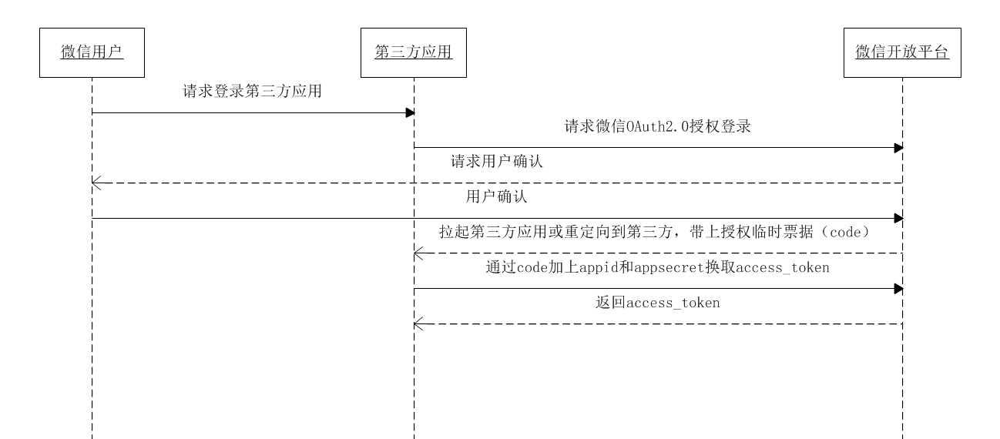
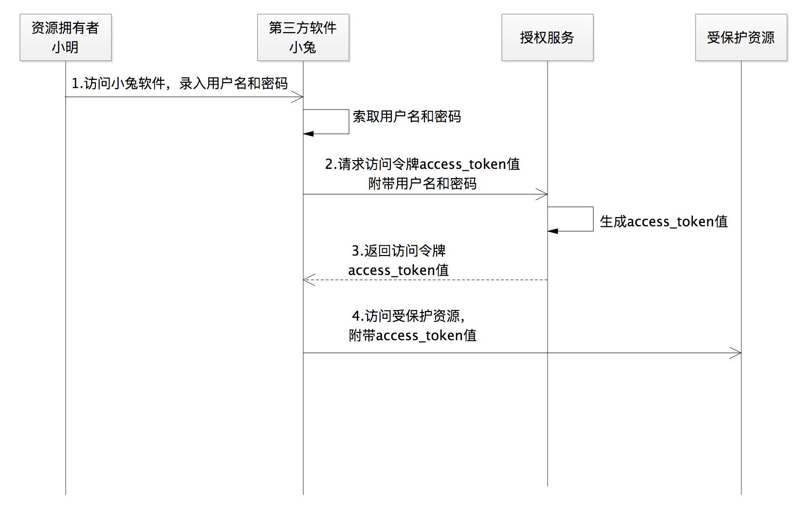

# OAuth2认证基础

## 1. 什么是OAuth2
OAuth 2.0 这种授权协议，就是保证第三方（软件）只有在获得授权之后，才可以进一步访问授权者的数据。
所以，我们常常还会听到一种说法，OAuth 2.0 是一种安全协议。
OAuth 2.0 授权的核心就是颁发访问令牌、使用访问令牌.

## 2. OAuth2的授权种类
- 授权码许可（Authorization Code）类型。它是 OAuth 2.0 中最经典、最完备、最安全、应用最广泛的许可类型。
- 除了授权码许可类型外，OAuth 2.0 针对不同的使用场景，还有 3 种基础的许可类型，分别是：
隐式许可（Implicit）、客户端凭据许可（Client Credentials）、资源拥有者凭据许可（Resource Owner Password Credentials）。
相对而言，这 3 种授权许可类型的流程，在流程复杂度和安全性上都有所减弱。

## 3. 授权码许可
### 4个角色：
- 资源拥有者：小明
- 三方软件：小兔软件
- 授权服务：京东开放平台授权服务
- 受保护资源：京东对应资源的微服务

### 为什么需要授权码？
- 如果不要授权码，直接返回access token,那我们肯定不能使用重定向的方式。
因为这样会把安全保密性要求极高的访问令牌暴露在浏览器上，从而将会面临访问令牌失窃的安全风险。

- 不用重定向的方式，就只能用发送请求的方式。但又会带来另一个问题：
当小明被浏览器重定向到授权服务上之后，小明跟小兔软件之间的 “连接” 就断了，
相当于此时此刻小明跟授权服务建立了“连接”后，将一直“停留在授权服务的页面上”。
小明再也没有重新“连接”到小兔软件。
(授权页是京东的，用户点击同意授权后，京东生成的授权码，是给小兔用的，如果不重定向，用户就会卡在授权页，体验不好)

- 所以才需要授权码，并且有两次重定向。
第一次，从小兔软件重定向到京东授权服务页；
第二次，在授权服务页，用户点击同意后，跳转到三方小兔软件。

### 间接通信和直接通信
- 这里所谓的间接通信就是指获取授权码的交互，第三方软件小兔和授权服务之间，并没有发生直接的通信，
而是通过浏览器这个“中间人” 来 “搭线”的。
- 直接通信就是指通过授权码换取访问令牌的交互，是直接发送请求进行的交互。

### 两个一伙
OAuth 2.0 中的 4 个角色是 “两两站队” 的：
- 资源拥有者和第三方软件“站在一起”，因为第三方软件要代表资源拥有者去访问受保护资源；
- 授权服务和受保护资源“站在一起”，因为授权服务负责颁发访问令牌，受保护资源负责接收并验证访问令牌。

### 是否一定需要浏览器？
不一定。和应用场景和有关。

在开发微信小程序应用时，我们通过授权码模式获取用户登录信息，
官方文档的地址示例中给出的 grant_type=authorization_code ，就没有用到浏览器。
开发者获取用户登录态信息的过程正是一个授权码的许可流程：
首先，开发者通过 wx.login(Object object) 方法获取到登录凭证 code 值，这一步的流程是在小程序内部通过调用微信提供的 SDK 实现；
然后，再通过该 code 值换取用户的 session_key 等信息，也就是官方文档的 auth.code2Session 方法，同时该方法也是被强烈建议通过开发者的后端服务来调用的。

也就是说，先通过小程序前端获取到 code 值，再通过小程序的后端服务使用 code 值换取 session_key 等信息，
只不过是访问令牌 access_token 的值被换成了 session_key。

### 流程细化
#### 1）小兔要去京东平台那里“备案”，也就是注册
- 注册完后，京东商家开放平台就会给小兔软件 app_id 和 app_secret 等信息，以方便后面授权时的各种身份校验。
- 注册的时候，第三方软件也会请求受保护资源的可访问范围。比如，小兔能否获取小明店铺 3 个月以前的订单，能否获取每条订单的所有字段信息等等。这个权限范围，就是 scope。

#### 2）授权服务需要完成两部分工作，分别是准备工作和生成授权码code
- 准备工作，即验证基本信息，包括对第三方软件小兔合法性和回调地址合法性的校验。
我们还需要对小兔传过来的 scope 参数，与小兔注册时申请的权限范围做比对。
如果请求过来的权限范围大于注册时的范围，就需要作出越权提示。记住，此刻是第一次权限校验。
验证通过后，就会生成或者响应一个页面（属于授权服务器上的页面），以提示小明进行授权。

- 小明点击“approve”按钮之后，生成授权码 code 的流程就正式开始了，
主要包括验证权限范围（第二次）、处理授权请求生成授权码 code 和重定向至第三方软件这三大步。
这里是用小明进行授权之后的权限，再次与小兔软件注册的权限做校验。

- OAuth 2.0 规范建议授权码 code 值有效期为 10 分钟，并且一个授权码 code 只能被使用一次。
不过根据经验呢，在生产环境中 code 的有效期一般不会超过 5 分钟。
授权服务还需要将生成的授权码 code 跟已经授权的权限范围 rscope 进行绑定并存储。

#### 3） access_token
- 有了授权码，小兔就可以通过授权码、app_id、app_secret等信息去获取access_token.
这里我们一定要记住，确认过授权码 code 值有效以后，应该立刻从存储中删除当前的 code 值，
以防止第三方软件恶意使用一个失窃的授权码 code 值来请求授权服务。

- 关于按照什么规则来生成访问令牌 access_token 的值，OAuth 2.0 规范中并没有明确规定，
但必须符合三个原则：唯一性、不连续性、不可猜性。
我们既可以生成一个 UUID 形式的数据存储起来，让授权服务和受保护资源共享该数据；
也可以将一些必要的信息通过结构化的处理放入令牌本身。我们将包含了一些信息的令牌，称为结构化令牌，简称 JWT。

- 和授权码 code 值一样，我们需要将访问令牌 access_token 值存储起来，
并将其与第三方软件的应用标识 app_id 和资源拥有者标识 user 进行关系映射。
也就是说，一个访问令牌 access_token 表示某一个用户给某一个第三方软件进行授权。

### 刷新令牌
- 在生成访问令牌的时候，我们还给它附加了一个过期时间 expires_in，
这意味着访问令牌会在一定的时间后失效。这样，就需要用户重新授权，走前面的流程。
为提升用户体验，OAuth 2.0 中引入了刷新令牌的概念，也就是刷新访问令牌 access_token 的值。
这就意味着，有了刷新令牌，用户在一定期限内无需重新点击授权按钮，就可以继续使用第三方软件。

- 第三方软件得到一个访问令牌的同时，也会得到一个刷新令牌。
刷新令牌存在的初衷是，在访问令牌失效的情况下，为了不让用户频繁手动授权，
用来通过系统重新请求生成一个新的访问令牌。
那么，如果访问令牌失效了，而“身边”又没有一个刷新令牌可用，岂不是又要麻烦用户进行手动授权了。
所以，它必须得和访问令牌一起生成。

- 一个刷新令牌被使用以后，授权服务需要将其废弃，并重新颁发一个刷新令牌。
LinkedIn为例，提供在固定时间段内有效的程序化刷新令牌。
默认情况下，访问令牌的有效期为 60 天，程序化刷新令牌的有效期为一年。 
当刷新令牌过期时，成员必须重新授权您的应用程序。

 

## 资源拥有者凭据许可

这种场景，意味着小兔软件已经被京东收购，是官方软件，可以被信任，也就没有了三方的概念。
这样，小兔软件只需要使用一次用户名和密码数据来换回一个access_token，进而通过access_token来访问小明店铺的数据，
以后就不会再使用用户名和密码了。
资源拥有者凭据许可 grant_type 的值为 password。
总结一下，如果软件是官方出品的，又要使用 OAuth 2.0 来保护我们的 Web API，那么你就可以采用资源拥有者凭据许可类型。

 

## 客户端凭据许可

如果没有明确的资源拥有者，换句话说就是，小兔软件访问了一个不需要用户小明授权的数据。
如获取京东 LOGO 的图片地址，这个 LOGO 信息不属于任何一个第三方用户，
再比如其它类型的第三方软件来访问平台提供的省份信息，省份信息也不属于任何一个第三方用户。
这里 grant_type 的值为 client_credentials。
总结一下，在获取一种不属于任何一个第三方用户的数据时，并不需要类似小明这样的用户参与，
此时便可以使用客户端凭据许可类型：
第三方软件可以直接使用注册时的 app_id 和 app_secret 来换回访问令牌access_token 的值。

 

## 隐式许可
如果小明使用的小兔打单软件应用没有后端服务，就是在浏览器里面执行的，比如纯粹的 JavaScript 应用。
在这种情况下，小兔软件对于浏览器就没有任何保密的数据可以隐藏了，也不再需要应用密钥 app_secret 的值了，
也不用再通过授权码 code 来换取访问令牌 access_token 的值了。
因此，隐式许可授权流程的安全性会降低很多。
在授权流程中，没有服务端的小兔软件相当于是嵌入到了浏览器中，访问浏览器的过程相当于接触了小兔软件的全部。
使用场景已经很少。

 

## PKCE协议
PKCE协议是一个补充协议，一般用在没有服务器端的移动APP上。
对于一个移动App:
如果有 Server 端，就建议通过 Server 端和授权服务做交互来换取访问令牌，使用授权码许可即可；
如果没有 Server 端，那么只能通过前端通信来跟授权服务做交互，比如在上一讲中提到的隐式许可授权类型。
但是，这种方式的安全性就降低了很多。
问题的关键在于如何保存 app_secret，因为 App 会被安装在成千上万个终端设备上，
app_secret 一旦被破解，就将会造成灾难性的后果。
于是就有了PKCE协议。

1）App 自己要生成一个随机的、长度在 43~128 字符之间的、参数为 code_verifier 的字符串验证码；
接着，我们再利用这个 code_verifier，来生成一个被称为“挑战码”的参数code_challenge。

2）在第一步获取授权码 code 的时候，我们使用 code_challenge 参数。需要注意的是，
我们要同时将 code_challenge_method 参数也传过去，
目的是让授权服务知道生成 code_challenge 值的方法是 plain 还是 S256。
（一种 code_challenge_method=plain，此时 code_verifier 的值就是 code_challenge 的值；
另外一种 code_challenge_method=S256，就是将 code_verifier 值进行 ASCII 编码之后再进行哈希，
然后再将哈希之后的值进行 BASE64-URL 编码）

3）在第二步获取访问令牌的时候，我们使用 code_verifier 参数，授权服务此时会将 code_verifier 的值进行一次运算。
那怎么运算呢？就是上面 code_challenge_method=S256 的这种方式。
第一步请求授权码的时候，已经告诉授权服务生成 code_challenge 的方法了。
所以，在第二步的过程中，授权服务将运算的值跟第一步接收到的值做比较，如果相同就颁发访问令牌。

总结一下就是，换取授权码 code 的时候，我们使用 code_challenge 参数值；
换取访问令牌的时候，我们使用 code_verifier 参数值。

那么，在没有了 app_secret 这层保护的前提下，即使我们的授权码 code 被截获，
再加上 code_challenge 也同时被截获了，那也没有办法由 code_challenge 逆推出 code_verifier 的值。
而恰恰在第二步换取访问令牌的时候，授权服务需要的就是 code_verifier 的值。
因此，这也就避免了访问令牌被恶意换取的安全问题。

建议的是，移动App还是应该有自己的后端Server.